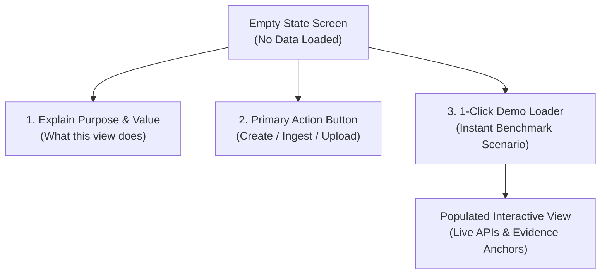

# Frontend Design Thinking & UI/UX Specifications

> **Location:** `docs/my docs/front design thinking folder/DESIGN-THINKING.md`  
> **Target:** Testing Workbench Frontend (HR Port + Student Port)  
> **Design Framework:** UI/UX Pro Max Intelligence (SaaS Dashboard Pattern + Glassmorphism Accents)  
> **Core Principle:** Dual Experience, Single Intelligence Core (双端体验、单一智能底座)

---

## 1. Empathy & Problem Statement

### 1.1 The Two User Personas

| Persona | Core Pain Point | What They Need from the UI | Key UI Job |
| :--- | :--- | :--- | :--- |
| **HR User (Hiring Manager / Recruiter)** | Legacy ATS filters reject qualified candidates with non-standard job titles, while letting buzzword stuffers through. | A clean cockpit to turn rough demands into frozen standards, and an omission triage queue highlighting rescued candidates. | Standard formulation matrix + Batch review cards with line-anchored evidence. |
| **Student User (Candidate / Applicant)** | Black-box ATS gives vague rejections or fake "82% match" scores that offer zero actionable guidance. | Honest, objective evidence diagnosis against authentic frozen standards with verbatim line quotes and interview preparation tips. | 4-state evidence distribution badges + Customized interview follow-up questions. |

---

## 2. Empty State Design Philosophy (Empty States as On-Ramps)

In testing workbenches, an empty screen with an empty table is an anti-pattern. **Empty states must educate the user and provide a 1-click action to load demo scenarios.**

### The 3 Core Empty States:

### Empty State 1: HR Standard Formulation (`#empty-standard`)
* **Visual**: Clean vector blueprint icon with subtle dashed border.
* **Heading (EN / 中文)**: "No Hiring Standard Created" / "尚未创建岗位标准"
* **Copy**: "Start by clarifying raw enterprise business tasks, or instantly load the P0 Junior/Intern AI PM benchmark standard." / "从输入用人部门原始业务需求开始，或一键载入 P0 初级/实习 AI 应用产品经理官方基准。"
* **Action Buttons**:
  - Primary: `+ Create Standard Draft` / `+ 创建标准草案`
  - Secondary: `⚡ Load P0 Benchmark Standard` / `⚡ 载入 P0 官方标准`

### Empty State 2: HR Candidate Review Queue (`#empty-candidates`)
* **Visual**: Filter funnel icon with highlight badge.
* **Heading (EN / 中文)**: "Candidate Review Queue Empty" / "候选人复核队列为空"
* **Copy**: "Upload an anonymized resume batch to run automated omission rescue and overestimation triage." / "导入脱敏候选人批次，系统将自动执行漏筛打捞与防虚高复核。"
* **Action Buttons**:
  - Primary: `Upload Batch Resumes` / `导入候选人批次`
  - Secondary: `⚡ Load 4-Archetype Benchmark Batch` / `⚡ 载入 4 类典型候选人测试集`

### Empty State 3: Student Evidence Diagnosis (`#empty-student`)
* **Visual**: Document diagnostic stethoscope icon.
* **Heading (EN / 中文)**: "No Resume Diagnosed Yet" / "尚未进行简历证据诊断"
* **Copy**: "Paste your resume or project report to receive an objective 4-state evidence breakdown against the frozen hiring standard. No fake percentages." / "输入您的简历或项目材料，系统将比对已冻结的企业标准，提供真实的4态证据诊断，绝不输出虚假匹配度。"
* **Action Buttons**:
  - Primary: `Paste & Diagnose Resume` / `输入材料开始诊断`
  - Secondary: `⚡ Load Sample Student Resume` / `⚡ 载入学生样例材料`

---

## 3. Bilingual (i18n) Information Architecture

The testing workbench natively supports instant English / Chinese toggle (`EN` | `中文`) across all navigation items, cards, badges, and empty states.

### Core Terminology Mapping:

| Key Architectural Term | English Label | 中文规范表述 | UI Token / Badge |
| :--- | :--- | :--- | :--- |
| **Product Philosophy** | Dual Experience, Single Core | 双端体验、单一智能底座 | Header subtitle |
| **HR Port** | HR Workbench | HR 招聘复核工作台 | Navigation Tab 1 |
| **Student Port** | Student Diagnosis | 学生端证据自诊断 | Navigation Tab 2 |
| **Triage: Rescued** | Priority Review (Rescued) | 优先复核（漏筛打捞） | Emerald Badge |
| **Triage: Buzzword Alert** | Needs Evidence (Overestimated) | 待补充证据（防虚高预警） | Amber Badge |
| **Triage: Standard Match** | Standard Review | 常规复核 | Blue Badge |
| **Triage: Reject** | Not Supported | 不予支持 | Gray Badge |
| **Evidence State: 1** | SUPPORTED | 已证实（有行动、产出与指标） | `badge-supported` (Green) |
| **Evidence State: 2** | PARTIAL | 部分满足（有执行缺量化指标） | `badge-partial` (Amber) |
| **Evidence State: 3** | MATERIAL_INSUFFICIENT | 材料不足（仅提及概念） | `badge-insufficient` (Purple) |
| **Evidence State: 4** | NO_EVIDENCE | 完全无提及（空能力原则） | `badge-no-evidence` (Slate) |

---

## 4. UI/UX Pro Max Design Tokens

* **Palette**:
  - Primary Brand: `#2563EB` (Royal Blue)
  - Primary Hover: `#1D4ED8`
  - Surface Background: `#F8FAFC` (Slate 50)
  - Card Glass Background: `rgba(255, 255, 255, 0.85)` with `backdrop-filter: blur(12px)`
  - Card Border: `1px solid #E2E8F0`
  - Dark Typography: `#0F172A` (Headings), `#334155` (Body text), `#64748B` (Muted labels)
  - State Green (`SUPPORTED`): `#10B981` (Background: `#ECFDF5`, Border: `#A7F3D0`)
  - State Amber (`PARTIAL`): `#F59E0B` (Background: `#FFFBEB`, Border: `#FDE68A`)
  - State Purple (`MATERIAL_INSUFFICIENT`): `#6366F1` (Background: `#EEF2FF`, Border: `#C7D2FE`)
  - State Slate (`NO_EVIDENCE`): `#94A3B8` (Background: `#F1F5F9`, Border: `#CBD5E1`)
* **Typography Stack**:
  - Latin: `Inter, -apple-system, BlinkMacSystemFont, "Segoe UI", Roboto, sans-serif`
  - CJK: `"PingFang SC", "Hiragino Sans GB", "Microsoft YaHei", sans-serif`
* **Accessibility**: Minimum text-to-background contrast ratio $\ge 4.5:1$ across all badges and controls.
* **Component Standards**:
  - Clean Lucide-style vector SVG icons for all buttons and tabs.
  - Hover states with smooth `transition: all 0.2s ease`.
  - Visible focus rings (`focus:ring-2 focus:ring-blue-500`) for keyboard accessibility.

---

## 5. Live Backend Integration & Fallback Mode

The testing workbench connects directly to the Fastify backend via `fetch()`:
* **API Base URL**: Configurable in top bar (default: `http://127.0.0.1:3000/api/v1`).
* **Live Connection Indicator**:
  - Green pulse pill: `API Connected (Fastify 3000)`
  - Amber pill: `Offline - Using Built-in Mock Adapter`
* **Zero Configuration Friction**: Even if the backend server is stopped, clicking any button automatically falls back to deterministic client-side mock fixtures so the user can test and experience all features immediately!
